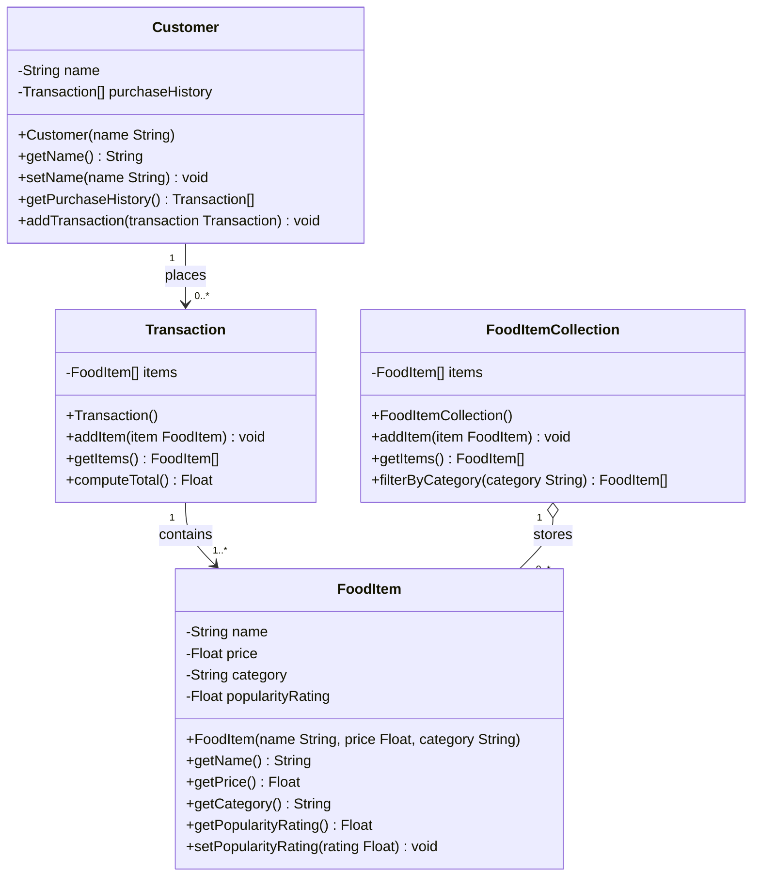

---

## Architect's Note

### What was removed and why

Four additions from the previous draft were cut because none of them trace back to a spec requirement. Each one was a reasonable anticipation of a future need, but anticipation is not justification. The spec is the contract; the diagram should model the contract, not speculate beyond it.

1. **`Customer.id`** -- The spec says "verify they are legitimate customers" via purchase history, not via a unique identifier field. An ID may become necessary when persistence or authentication enters the picture, but neither is in scope. Removed.

2. **`FoodItem.isActive` + `setActive()`** -- Soft-delete is a catalog lifecycle concern the spec does not mention. The spec says "track" items and "browse" them, not "deactivate" them. This also eliminates the domain-leak problem the previous draft flagged (active/inactive state bleeding into transaction history). Removed.

3. **`Transaction.status` + `finalize()` + `getStatus()`** -- The spec says "store selected items" and "compute total cost." There is no mention of transaction lifecycle, completion states, or finalization. If the business needs this later, it can be added with a clear requirement behind it. Removed.

4. **`FoodItemCollection.removeItem()` + `getAllItems()`** -- The spec asks for two capabilities: store items and filter by category. `removeItem()` was serving the soft-delete pattern that no longer exists. `getAllItems()` was distinguishing "active only" from "everything" -- a distinction that only mattered because of `isActive`. With soft-delete gone, `getItems()` returns the full collection and `filterByCategory()` narrows it. That is exactly what the spec asks for. Removed.

### What remains and why it earns its place

- **`Customer.setName()`** -- The spec says "manage customers." Manage implies mutability. Name is the only Customer-owned field (purchaseHistory is mutated via `addTransaction()`), so it gets a setter.
- **`FoodItem.setPopularityRating()`** -- popularityRating is not intrinsic to the item (unlike name, price, category). It evolves over time based on external input. It defaults to 0.0 at construction and is updated via setter. Without this setter, the field is a dead end.
- **`FoodItemCollection.getItems()`** -- The spec says the collection "holds all items." Retrieving them is the baseline read operation of any collection. `filterByCategory()` is the spec's additional capability on top of that.

### Dead-end field audit

| Class | Field | Write path | Read path |
|---|---|---|---|
| Customer | name | Constructor + setName() | getName() |
| Customer | purchaseHistory | addTransaction() | getPurchaseHistory() |
| FoodItem | name | Constructor | getName() |
| FoodItem | price | Constructor | getPrice() |
| FoodItem | category | Constructor | getCategory() |
| FoodItem | popularityRating | Default 0.0 + setPopularityRating() | getPopularityRating() |
| FoodItemCollection | items | addItem() | getItems(), filterByCategory() |
| Transaction | items | addItem() | getItems() |

No orphaned fields.

### Consistency audit

- **Constructors:** Customer takes `name`. FoodItem takes `name, price, category` (three intrinsic properties). Transaction and FoodItemCollection take no arguments (they start empty and are populated via `addItem()`). Every class has a constructor.
- **Setter policy:** Only two setters exist: `setName()` on Customer (spec says "manage") and `setPopularityRating()` on FoodItem (evolving metric, not intrinsic). No other class has setters because no other field requires post-construction mutation per the spec.
- **Collection mutation:** Both FoodItemCollection and Transaction expose `addItem()` for populating their internal arrays. Customer exposes `addTransaction()` for the same purpose. Consistent pattern across all aggregating classes.
