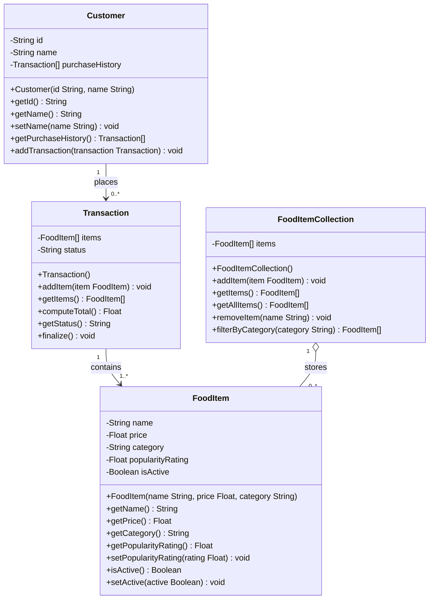

---

## Architect's Note

### What changed in this revision and why

#### 1. Customer identity -- `id` field added

The previous revision flagged this explicitly: "Customer identity is underspecified. Names are not unique identifiers." The spec says "verify that users are legitimate customers" but provided no mechanism. An `id` field (String, accommodating UUIDs or external IDs) solves this. The constructor now requires it: `Customer(id, name)`. A customer without an identity is not a valid entity.

`id` has a getter but no setter. An identifier is immutable by definition -- if you change the ID, you have a different customer. This follows the same rule applied to FoodItem's `name` and `price`: fields that define what the object IS are set at construction and not mutated.

**Considered and rejected:** An auto-generated ID inside the constructor (e.g., UUID.randomUUID()). This couples the domain object to an ID generation strategy. The caller should control the ID -- it may come from a database, an external auth system, or a test harness. Keep the domain object dumb about infrastructure.

#### 2. popularityRating -- removed from constructor, default 0.0, setter added

The previous revision flagged this: "FoodItem popularity rating source is still undefined." Requiring it as a constructor parameter forced callers to invent a value at creation time, which is dishonest -- nobody knows a new item's popularity at birth.

The fix: `popularityRating` defaults to 0.0 (set internally, not a constructor parameter) and is updated via `setPopularityRating(rating)`. The constructor is now `FoodItem(name, price, category)` -- three intrinsic properties that genuinely define the item.

**This introduces a setter on FoodItem, which the previous revision explicitly rejected.** The reconciliation is straightforward: `name`, `price`, and `category` are intrinsic identity properties -- a Spicy Burger at $8.99 in the Burgers category. `popularityRating` is not intrinsic. It is an externally derived metric that changes over time based on transaction history, user reviews, or manual curation. It does not define what the item IS; it describes how the item is PERFORMING. Different category of field, different mutability rule. The setter is scoped to this one field, not a blanket "FoodItem is now mutable."

**Considered and rejected:** A separate `RatingService` or `PopularityTracker` class that holds ratings externally, keyed by food item. This is the "purer" DDD approach but violates KISS for this system's scale. A single setter on the entity is the right level of complexity until there is evidence that rating logic needs its own home.

#### 3. Transaction finalization -- `status` field and `finalize()` method

The previous revision flagged this: "Transaction finalization is not modeled. A Transaction can have items added to it indefinitely."

The fix: a `status` field (String, defaults to `"open"` at construction) and a `finalize()` method that transitions status to `"complete"`. `getStatus()` exposes the current state.

`finalize()` is a one-way operation. An open transaction can be finalized; a finalized transaction cannot be reopened. This is a deliberate constraint. If the business needs refunds or cancellations, that is a separate concern (a RefundTransaction, a status reversal service, etc.) -- not a reason to make finalization reversible on the base Transaction object.

**Behavioral implication that must be enforced in implementation:** `addItem()` should refuse to add items to a finalized transaction. The diagram does not model this guard (UML class diagrams are structural, not behavioral), but the implementation must enforce it. If items can be added after finalization, the status field is meaningless theater.

**Considered and rejected:**
- An enum for status instead of String. Correct for implementation, but UML class diagrams conventionally use String for readability. The implementation should absolutely use an enum or equivalent.
- A `submit()` method name instead of `finalize()`. Both are acceptable. `finalize()` was chosen because it implies irreversibility more strongly than `submit()`, which in some domains implies "submitted for review" (reversible). The name signals the one-way intent.

#### 4. Soft-delete on FoodItem and FoodItemCollection

Added `isActive` (Boolean, defaults to `true`) to FoodItem with `isActive()` and `setActive(active)`. Added `removeItem(name)` to FoodItemCollection, which performs a soft delete by calling `setActive(false)` on the matching item.

`getItems()` on FoodItemCollection now returns only active items -- this is the menu that customers browse. `getAllItems()` returns everything including deactivated items -- this is for admin/audit purposes.

**This is the change I have the most reservations about.** The `isActive` flag lives on FoodItem itself, which means every FoodItem everywhere -- including inside completed Transactions -- carries an active/inactive flag. If a customer bought a "Seasonal Salad" last month and that item is later deactivated from the menu, the FoodItem inside their Transaction now reports `isActive() == false`. That is a catalog concern leaking into transaction history. The customer's past purchase was valid; the item's current menu status is irrelevant to the historical record.

**Why I am implementing it this way anyway:** The alternative -- a wrapper class like `CatalogEntry` that holds a FoodItem plus an `isActive` flag, or a separate active/inactive tracking structure in FoodItemCollection -- adds a layer of indirection that is not justified at this system's current scale. The leak is real but the damage is contained: Transaction's `getItems()` does not filter by `isActive`, so historical records remain intact. The filtering only happens in FoodItemCollection's `getItems()`. If this becomes a problem (and it might), the fix is to extract `isActive` into the collection layer. For now, KISS wins.

**Naming note:** `removeItem(name)` on FoodItemCollection uses the item's name as the lookup key. This works only if item names are unique within a collection. If they are not, this method is ambiguous. The spec treats items like "Spicy Burger" and "Large Soda" as distinct named entities, so uniqueness is assumed. If that assumption breaks, the method signature needs to change (e.g., accept a FoodItem reference instead of a String name).

### Dead-end field audit (per standing rule)

Every private field in every class has been verified against the governing rule: each field has either a constructor parameter or a mutator method as its write path.

| Class | Field | Write path | Read path |
|---|---|---|---|
| Customer | id | Constructor | getId() |
| Customer | name | Constructor + setName() | getName() |
| Customer | purchaseHistory | addTransaction() | getPurchaseHistory() |
| Transaction | items | addItem() | getItems() |
| Transaction | status | Constructor default + finalize() | getStatus() |
| FoodItem | name | Constructor | getName() |
| FoodItem | price | Constructor | getPrice() |
| FoodItem | category | Constructor | getCategory() |
| FoodItem | popularityRating | Default 0.0 + setPopularityRating() | getPopularityRating() |
| FoodItem | isActive | Default true + setActive() | isActive() |
| FoodItemCollection | items | addItem() | getItems(), getAllItems() |

No orphaned fields. No dead ends.

### Consistency audit (per standing rule)

All four changes have been cross-checked against every class:

- **Identity fields:** Customer now has `id`. Transaction, FoodItem, and FoodItemCollection do not. Transaction is identified by its position in a Customer's history (no independent lookup need established by spec). FoodItem is identified by `name` within a collection (sufficient given the spec's examples). FoodItemCollection is a singleton container with no identity need.
- **Default-initialized fields:** `popularityRating` (0.0), `isActive` (true), `status` ("open"), `purchaseHistory` (empty), `items` (empty on Transaction and FoodItemCollection). All have defined write paths.
- **Setter policy:** Customer gets `setName()` (spec says "manage"). FoodItem gets `setPopularityRating()` (external metric) and `setActive()` (catalog lifecycle). Transaction gets `finalize()` (one-way state transition, not a general setter). FoodItemCollection gets no setters on its own fields -- only mutators that operate on contained items.

### Risks and flags

- **`isActive` domain leak** (detailed above). Monitor whether the active/inactive concept causes confusion when FoodItems appear in transaction history. If it does, extract the flag to the collection layer.
- **`finalize()` guard not modeled.** Implementation must prevent `addItem()` after finalization. This is a behavioral constraint that the class diagram cannot express. Consider a sequence diagram for the transaction lifecycle if the team needs clarity on this flow.
- **`removeItem(name)` assumes unique names.** If two items can share a name (e.g., "Special" in multiple categories), this method needs a different signature. The spec does not suggest this is a problem today, but it is worth noting.
- **No `removeTransaction()` on Customer.** The spec does not require removing transactions from purchase history, and soft-delete was only requested for the menu/catalog context. If transaction removal becomes a need, the same soft-delete pattern could apply -- but do not add it preemptively.
